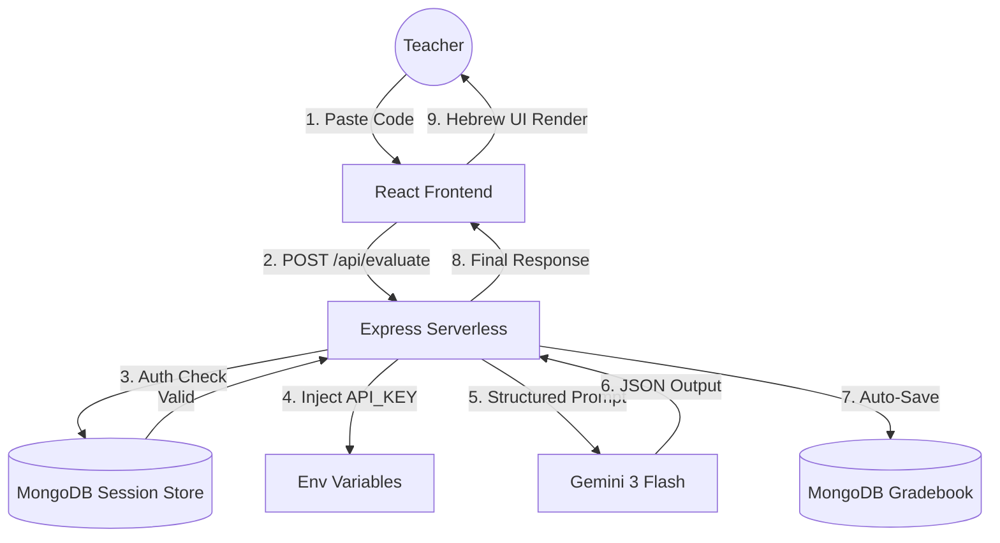

# 📐 System Architecture & Security Specification

This document provides a technical deep-dive into the AI Code Grader infrastructure. The system is designed as a secure, high-availability SaaS platform leveraging modern serverless paradigms.

---

## 1. High-Level System Overview

The application utilizes a **Decoupled Full-Stack Architecture**:

  

*   **Frontend Layer**: A specialized Single Page Application (SPA) built with **React 19** and **Vite**. It handles state management for the grading session and provides a real-time "Sheets" view for class management.
*   **API Layer (Backend)**: An **Express.js** engine deployed as **Vercel Serverless Functions**. This layer acts as a secure gateway, managing authentication, database transactions, and AI orchestration.
*   **Persistence Layer**: A distributed **MongoDB Atlas** cluster storing teacher profiles, encrypted session tokens, and the student gradebook.
*   **Intelligence Layer**: **Google Gemini API** (Gemini 3 Flash), accessed via the `@google/genai` SDK on the server-side to ensure API key security.

---

## 2. Security Architecture

Security is integrated at every layer of the stack to protect sensitive student data and intellectual property.

### 🔐 Authentication & Identity
The system implements **OAuth 2.0** via Google Identity Services. 
- **Passport.js** manages the strategy on the backend.
- Upon successful login, a unique user record is created/linked in MongoDB based on the `googleId`.
- No passwords are ever stored or processed by our infrastructure.

### 🍪 Session Management
- **Stateful Sessions**: Sessions are managed using `express-session` and persisted in MongoDB via `connect-mongo`.
- **Security Policy**: A strict **2-hour sliding expiration** is enforced. If a user is inactive for 120 minutes, the session is invalidated both in the browser (cookie) and the database.
- **CSRF & Proxy Protection**: `app.set('trust proxy', 1)` is enabled to allow secure cookie transmission through Vercel's load balancers.

### 🛡️ Secret Protection
- **Zero-Exposure Policy**: The Gemini `API_KEY` and Google Client Secrets are stored exclusively in Vercel's encrypted Environment Variables.
- **Backend Proxying**: All AI evaluations are proxied through the `/api/evaluate` endpoint. The frontend never communicates directly with Google’s servers, preventing API key extraction from the browser's network tab.

---

## 3. Runtime Data Flow (Grading Engine)

The diagram below illustrates the lifecycle of a single grading request:

---

## 4. DevOps & Deployment

### CI/CD Pipeline
- **Atomic Deploys**: Every push to the main branch triggers a Vercel deployment. 
- **Build Optimization**: Vite performs tree-shaking and asset minification to ensure the frontend bundle remains under 200KB.
- **Edge Distribution**: The frontend is cached globally at the Edge, while the `/api` functions run in the region closest to the MongoDB Atlas cluster to minimize latency.

### Database Strategy
- **Idempotent Connection**: The backend uses a "Cached Connection" pattern to reuse MongoDB sockets across serverless invocations, preventing "Too many connections" errors during traffic spikes.

---
*Last Updated: v1.2.0 | Confidential & Proprietary*