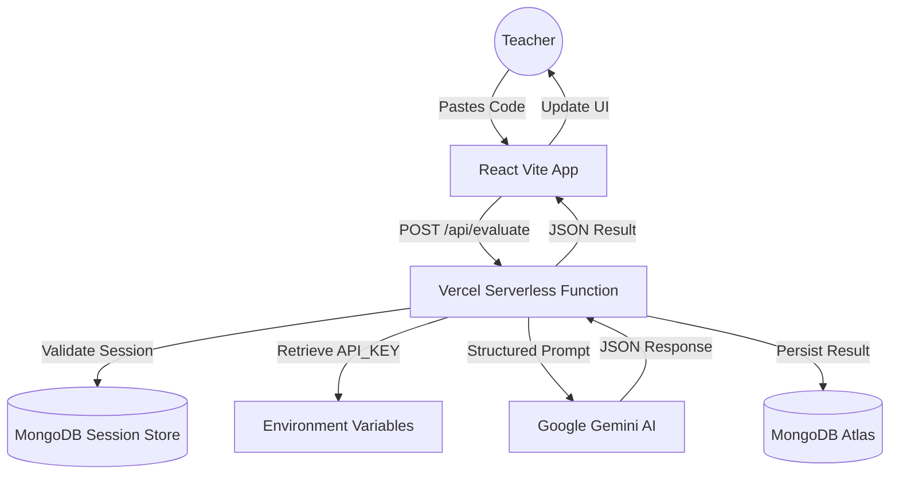

# 📐 System Architecture & DevOps

This document details the flow of data and the deployment lifecycle of the AI Code Grader.

## 🔄 Runtime Data Flow

The following diagram illustrates how a grading request is processed securely without exposing secrets to the browser.

## 🛠️ DevOps Lifecycle

1.  **Commit**: Code is pushed to the repository.
2.  **Build**: Vercel triggers a build, bundling React with Vite and preparing Serverless Functions in `/api`.
3.  **Deploy**: The app is served via Vercel's Edge Network.
4.  **Security**: Headers are set to handle CORS and `trust proxy` for secure cookie management.

## 🎨 Infographic Design Prompt
Use the prompt below in a high-quality AI Image Generator to create a visual representation of this architecture:

> **Prompt:** A professional 2x2 grid infographic showing a "DevOps & SaaS Architecture" for a web application. The flow starts from a Code Commit (GitHub), goes through CI/CD (Vercel), to a Serverless Node.js backend, connecting to MongoDB Atlas and Google Gemini AI API. 
> 
> **Top-Left (Modern Apple Style):** Ultra-clean, white background, soft rounded glassmorphism cards, san-serif typography, subtle shadows, high-end minimalist icons.
> **Top-Right (n8n Workflow Style):** Dark mode canvas with nodes and curved connecting lines. Each step (Auth, DB, AI) is a functional block with input/output indicators.
> **Bottom-Left (Lego Style):** The entire architecture built out of 3D Lego bricks. The "Database" is a stack of blue bricks, "AI" is a glowing brain brick, and "User" is a mini-figure holding a laptop.
> **Bottom-Right (AWS Style):** Standard technical cloud architecture diagram using AWS-like icons (Lambda symbols for serverless, Shield for auth, Database cylinders). 
> 
> **Instructions:** Blur all sensitive strings like IP addresses or domain names. Professional lighting, 4k resolution, high contrast, organized layout.

---
*Last Updated: v1.2.0*